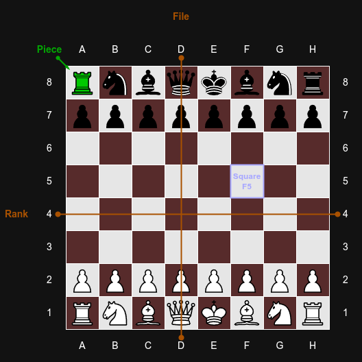
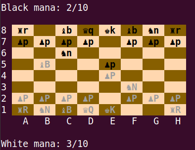

### File Overview
- [Design Document - Description of Approach](Design_Document.md)
- Milestone 1 - Structure, Config Parsing and Printing (this file)
- [Milestone 2 - Commands, Game Logic and Special Powers](Milestone_2.md)
- [Piece Overview (file listing all pieces and their special powers)](Pieces.md)
- [Items Overview (file listing all items, their powers and usage)](Items.md)
- [Error Overview (file listing all errors that must be handled)](Errors.md)

# Milestone 1 - Structure, Config Parsing and Printing
The **goal** of Milestone 1 (M1) is to implement the **basic structure** of the game and generate **initial console output**.

This includes creating basic classes in an object-oriented structure based on your [design document](Design_Document.md).

## Definitions

The following definitions are important for understanding the game description.

<details>
<summary><h3> Turns and Rounds </h3></summary>

In Chess++, a _turn_ consists of one or more moves made by a single player until they pass or the other player becomes able to make a move. This behavior is controlled on a per-piece basis, where special powers may come into play.

A _round_ consists of two turns, always starting with a white turn followed by a black turn.

For a more detailed description see ([Milestone 2](./Milestone_2.md) > Player Turn).

</details>

<details>
<summary><h3> Rank, File, Square and Coordinates </h3></summary>

A _rank_ refers to a row on the chessboard and is numbered from 1 to 8. 
A player's back rank is the rank on which their non-pawn pieces start (1 for white and 8 for black), while their front rank is where the pawns start (rank 2 for white and 7 for black).

A _file_ refers to a column on the chessboard and is labeled from A to H.

A single square on the chessboard is specified by the file followed by the rank, such as `F5` or `G6`. This is referred to as a coordinate.
This can be seen in the following diagram:



</details>

<details>
<summary><h3> Chessboard Distance </h3></summary>

For distance measurements on the chessboard, we use chessboard distance (also known as Chebyshev distance). It is defined as the maximum of the horizontal and vertical distances between two squares:

$$\max(|file_1 - file_2|, |rank_1 - rank_2|)$$

</details>

<details>
<summary><h3> Straight Lines and Neighbors </h3></summary>

A _straight line_ on the chessboard can be:

- horizontal (along a rank),
- vertical (along a file), or
- diagonal (moving both horizontally and vertically at the same rate).

Each square has up to 8 neighboring squares, which are all squares with a chessboard distance of 1.

</details>

<details>
<summary><h3> IDs, Types and Names </h3></summary>

Each chess piece (normal or special) has a `PIECE_ID` that uniquely identifies its exact type, including any special powers. This ID is used in the config file to define pieces (see [Initialisation](Milestone_1.md#initialisation) > Parsing the Game Config File).

Additionally, each piece has a `PIECE_TYPE`, which distinguishes between pawns, rooks, knights, bishops, queens, and kings, but does not include special powers. This type is used for the `move` command (see [Milestone 2](Milestone_2.md) > Command move).

Finally, each piece has a `SHORT_NAME`, which is used to display it on the game board (see [Playing the Game](Milestone_1.md#playing-the-game) > Game Board Printing).

</details>

<details>
<summary><h3> Special Powers </h3></summary>

Some [pieces](./Pieces.md) have effects beyond standard chess movement. These are called special powers and are divided into two categories: _passive_ and _active_.

- _Active_ powers require the `special` command to be used.
- _Passive_ powers are triggered automatically when their conditions are met.

> **Note:** All active powers require mana to be activated while passive powers do not.

</details>

## Important Rules

The following rules describe how key mechanics in the game are handled.

<details>
<summary><h3> Normal and Special Moves </h3></summary>

In general, a player can make two types of moves: a normal chess move using the `move` command or a special move using the `special` command. Passive special powers are considered part of normal chess moves.

 For check, checkmate and stalemate only normal chess moves are considered.

</details>

<details>
<summary><h3> Check, Checkmate, Stalemate </h3></summary>

 A player is in _check_ if their king is currently under attack, as defined in [Important Rules](Milestone_1.md#important-rules) > Attacks and Illegal Moves. This means only normal chess moves are considered.

A player is _checkmated_ if:

1. Their king is currently in check.
2. There exists no normal chess move that results in the king not being in check.
3. It is currently their turn.

Unlike standard chess, this **does not end the game**, but prevents the player from making any normal chess moves. Only special powers and potions can be used.

A player is _stalemated_ if:
1. Their king is currently **not** in check.
2. There exists no normal chess move that results in the king not being in check.
3. It is currently their turn.
4. The player is currently not able to pass their turn (see [Milestone 2](Milestone_2.md) > Command pass).

Like checkmate this **does not end the game**, but prevents the player from making any normal chess moves. Only special powers can be used. If a player resigns while in stalemate the game is considered a draw.

</details>
<details>
<summary><h3> Special Powers and Mana </h3></summary>

Some chess pieces have _special powers_. These are divided into active and passive powers.

Active special powers can be used instead of making a normal move by using the `special` command. Each player has their own _mana_ pool with a limited capacity. Using active powers consumes mana and may therefore not always be possible.

Passive special powers are always enabled and do not require mana or the use of the `special` command. They activate automatically when their specific conditions are met.

The special powers differ from piece to piece and are described in detail [here](Pieces.md).

</details>
<details>
<summary><h3>Moves, Captures and Prison </h3></summary>

For pieces that move along straight lines (queen, bishop, rook), a valid _move_ must pass only through empty squares.

For all pieces, the destination square must either be empty or occupied by an opponent’s piece. If it is occupied, the piece on that square is _captured_ and moved to the player's _prison_.

Captured pieces can be displayed using the `prison` command (see [Milestone 2](Milestone_2.md) > Command prison).

</details>

<details>
<summary><h3> Attacks and Illegal Moves </h3></summary>

A square is considered under _attack_ if an opponent’s piece could move to it in a single move using the `move` command. Active special moves are not considered, but passive abilities and frozen pieces must be taken into account.

A piece is under attack if the square it occupies is under attack.

A move is illegal if it:
- does not follow the movement rules of the piece, or
- results in the player’s king being under attack.

However, using a special power **may** result in the player's king being under attack.

</details>

<details>
<summary><h3> Moving Multiple Times </h3></summary>

Due to certain special powers or board effects, a player may be able to move multiple times within a single turn.

In this case, the game proceeds as if the previous move had been made by the opponent, with the following exceptions:
1. The `special` and `use` commands are not available for additional moves.
2. The `pass` command is available.
3. Only the piece used in the initial move may be used for subsequent moves in the same turn.

</details>

<details>
<summary><h3> Frozen Pieces </h3></summary>

Some special powers can cause a piece to become frozen. A frozen piece cannot be moved or use special powers, but it can still be captured.

A piece remains frozen for a specified number of turns. It is no longer considered frozen once the owning player has completed the required number of turns, not counting the turn in which the piece became frozen.

</details>

<details>
<summary><h3> Winning the Game </h3></summary>

In this chess variant, checkmate does not automatically end the game, since special abilities may still save the king. Instead the game generally ends when a king is captured. For a more detailed description of all ways in which the game can end, see [Milestone 2](Milestone_2.md#game-end) > Game End.

The game can also be aborted at any time using the `quit` command (see [Milestone 2](Milestone_2.md) > Command quit).

</details>

## Initialisation

<details>
<summary><h3>Program Start</h3></summary>

The program is started with two command line arguments, the path to the game config file and the message config file.

```sh
./a2 <GAME_CONFIG_FILE> <MESSAGE_CONFIG_FILE>
```

This is an example of a valid program start:
```sh
./a2 configs/m1_game_config.txt configs/message_config.txt
```

If the program is called with:

- more or fewer command line arguments, or
- one or more files that cannot be opened for reading, or
- one or more files that do not start with the correct magic number,

the corresponding error message should be printed and the program should terminate with the correct return value (see [Return Values and Error Messages](#return-values-and-error-messages)). In case both files are invalid the game config file should be referenced in the error message.

The config files are text files. If a config file starts with the correct magic number (`MESSAGE\n` for the message config file and `GAME\n` for the game config file), you may assume that it is correctly formatted and contains only valid data. Further validation is not required.

</details>


<details>
<summary><h3> Parsing the Game Config File</h3></summary>

The game config file starts with the magic number `GAME\n`. It contains all parameters required to run the game.

It is divided into four sections: Gameplay Settings, White, Black, and Squares.
The White and Black sections are collectively referred to as player sections.

<details>
<summary><h4> Gameplay Settings </h4></summary>

The _gameplay settings_ section specifies the maximum number of turns after which the game ends, as well as the initial mana amount and mana pool size.

Below is the structure of it. `<MAX_TURN_COUNT>`, `<INITIAL_MANA>` and `<MANA_POOL_SIZE>` are stored as integers.

```
\n
turns: <MAX_TURN_COUNT>\n
mana: <INITIAL_MANA>/<MANA_POOL_SIZE>\n
```

</details>

<details>
<summary><h4>The Player Section</h4></summary>

A _Player_ section contains the player's initial ELO score and their starting formation.

Each config file always contains two player sections: one for `White` and one for `Black`.

A _Player_ section looks like the following:
```text
\n
<PLAYER_ID> (Elo = <ELO_SCORE>)\n
{\n
  <LIST_OF_FRONT_RANK>\n
  <LIST_OF_BACK_RANK>\n
}\n
```
> **Notes:**
> - Mind the two space indentation.
> - The first player in the file is always `White`, followed by `Black`.
> - Each player has exactly 16 pieces (15 + king).
> - Each list always contains exactly 8 entries.

Each player has an [Elo](https://en.wikipedia.org/wiki/Elo_rating_system) score (`<ELO_SCORE>`), stored as an integer.

<details>
<summary><h5 id="listof">The "List of" Construction</h5></summary>

A list of pieces consists of blocks in the format `[<COUNT>x]<PIECE_ID>`, where `[]` denotes an **optional** part that is omitted for single pieces.

- `<COUNT>` &mdash; Number of pieces of this type (range: `2`-`8`)
- `<PIECE_ID>` &mdash; Type of piece

Blocks are separated by `, `.
</details>

When parsing the config file, the order of the pieces must be preserved, as it determines their placement on the board.

> **Note:** We recommend using a dynamic container (like `vector` or `deque`) to preserve ordering.
</details>

<details>
<summary><h4>The Square Section</h4></summary>

The _Square_ section defines all special squares present in the game. There may be an arbitrary number of such squares, but each board coordinate may appear at most once.

A _Square_ section looks like this:

```text
\n
Squares\n
{\n
  <COORD>:\n
    - name: <SQUARE_ID>\n
  <COORD>:\n
    - name: SPAWN\n
    - list: <LIST_OF_ITEMS>\n
  ...
}\n
```

where each line inside the curly braces (`{}`) is a key-value pair consisting of a coordinate and a square config. Each square entry must have a corresponding `name` field, while only the spawn square also has a `list` field.

- `<COORD>` &mdash; Specifies the coordinate, where the square should be placed (standard chess format).
- `<SQUARE_ID>` &mdash; The square name to be placed at the specified coordinate.
- `<LIST_OF_ITEMS>` &mdash; The list of items to be spawned by the square. Formatted according to the _List Of_ construction.

</details>

<details>
<summary><b>Example</b></summary>
Below is an example of a config file. Note the omitted counts for single-piece entries.

```text
GAME\n
\n
turns: 10\n
mana: 0/10\n
\n
White (Elo = 1000)\n
{\n
  6xP, PNRV, PGLD\n
  2xRINV, N, 2xNICE, B, Q, K\n
}\n
\n
Black (Elo = 900)\n
{\n
  3xP, PNRV, 2xRINV, 2xRPNT\n
  2xN, 2xNICE, 2xB, Q, K\n
}\n
\n
Squares\n
{\n
  B2:\n
    - name: BOOST\n
  D6:\n
    - name: MANA\n
  C4:\n
    - name: SPAWN\n
    - list: FREEZE, SHIELD, TP, 2xLUKE, CLOAK\n
}\n
```

</details>

</details>

<details><summary><h3> Parsing the Message Config File</h3></summary>

The message config file contains error and description messages used by the program.

The first line must be the magic number `MESSAGE\n`.

All other lines are either key-value pairs (separated by `:`) or empty lines, which should be ignored.

Each line represents a text that should be printed at certain points in the game. The `<MESSAGE_TEXT>` string should be printed whenever the key `<MESSAGE_KEY>` is referenced in the assignment description.

```text
<MESSAGE_KEY>:<MESSAGE_TEXT>\n
```

Each `<MESSAGE_KEY>`:
- is **unique**
- is written in **uppercase with underscores**.
- starts with the type abbreviation followed by an underscore.

| Type Abbreviation  | Type        | Printing Prefix             |
|--------------------|-------------|-----------------------------|
|         E          | Error       | <code>[ERROR]&nbsp;</code>  |
|         D          | Description | _(no prefix)_               |

Rules:

- Each message must be printed with its corresponding prefix (if applicable).
- `<MESSAGE_TEXT>` must be printed exactly as written (case and whitespace sensitive).
- A newline character (`\n`) must be appended.
- Multi-line messages are **not** allowed, and will not be tested.

 <details>
 <summary><b>Example</b></summary>

  The message config file could for example look like this:
  ```
  MESSAGE\n
  E_NAME_OF_ERROR:A severe error occurred.\n
  D_PIECE_ID:This piece is very powerful!\n
  ```

  Printing these messages should then look like this:
  ```
  [ERROR] A severe error occurred.\n
  This piece is very powerful!\n
  ```
 </details>
</details>

## Playing the Game

<details>
<summary><h3> Starting the Game</h3></summary>

First, the welcome message is printed as follows:
```
<D_BORDER_D>
<D_WELCOME>
<D_BORDER_D>
```

The turn counter `<TURN_COUNT>` starts at `0` and is incremented before each turn. Each player's mana pool size is initialized to the value specified in the game config file (`<MANA_POOL_SIZE>`), and their current mana starts at `<INITIAL_MANA>`.

First, the pieces specified for the players’ front ranks are placed automatically, starting from file A and ending with file H.

The players then place their remaining pieces on the board. The placement order follows the order in the config file:
- White places their first piece, then Black places their first piece.
- After that, Black places their second piece, then White places their second piece, alternating in this pattern.

The prompt printed whenever a player places a piece is:

```
Where do you want to place <PIECE_ID> (<COUNT> remaining)?
<PLAYER_ID> > 
```

Where
- `<PIECE_ID>` is the identifier of the piece (as in the config file)
- `<COUNT>` is the number of pieces of this type still to be placed **including the current one**.
- `<PLAYER_ID>` is the color of the current player (`White` or `Black`)

If a player enters `auto`, all remaining pieces for that player are automatically placed in the first free positions on the back rank, from file A to H. All remaining placement prompts for that player are skipped.

Otherwise, the player must enter a coordinate. Pieces may only be placed on the player’s back rank. If the input is invalid or outside this range, the error message `E_INV_PARAM_SQUARE` is printed.

</details>

<details>
<summary><h3> Game Board Printing</h3></summary>

If board printing is enabled, the game board is displayed at the beginning of each player's turn. If a player is allowed to move multiple times in a single turn, the board is printed again before each subsequent input prompt.

Board printing is enabled by default but can be disabled (see [Milestone 2](Milestone_2.md) > Command board). If disabled, the board is never printed.

The game board in general is printed in the following format:
```
<D_CHESSBOARD_BORDER>
<D_BORDER_D>
Turn <TURN_COUNT> / <MAX_TURN_COUNT>\n
\n
<OPPONENT_ID> mana: <OPPONENT_MANA_AMOUNT>/<OPPONENT_MANA_POOL_SIZE>\n
\n
<BOARD>
\n
<PLAYER_ID> mana: <MANA_AMOUNT>/<MANA_POOL_SIZE>\n
<D_BORDER_D>
```

Where
- `<TURN_COUNT>` is the current turn
- `<MAX_TURN_COUNT>` is the maximum number of turns
- `<OPPONENT_ID>` is the color of the opponent (`White` or `Black`)
- `<OPPONENT_MANA_AMOUNT>` is the mana of the opponent
- `<OPPONENT_MANA_POOL_SIZE>` is the mana pool size of the opponent
- `<PLAYER_ID>` is the color of the current player (`White` or `Black`)
- `<MANA_AMOUNT>` is the mana of the current player
- `<MANA_POOL_SIZE>` is the mana pool size of the current player
- `<BOARD>` is the actual chessboard, which is printed in the following format:

```
<RANK> <SQUARE><SQUARE><SQUARE><SQUARE><SQUARE><SQUARE><SQUARE><SQUARE>\n
<RANK> <SQUARE><SQUARE><SQUARE><SQUARE><SQUARE><SQUARE><SQUARE><SQUARE>\n
<RANK> <SQUARE><SQUARE><SQUARE><SQUARE><SQUARE><SQUARE><SQUARE><SQUARE>\n
<RANK> <SQUARE><SQUARE><SQUARE><SQUARE><SQUARE><SQUARE><SQUARE><SQUARE>\n
<RANK> <SQUARE><SQUARE><SQUARE><SQUARE><SQUARE><SQUARE><SQUARE><SQUARE>\n
<RANK> <SQUARE><SQUARE><SQUARE><SQUARE><SQUARE><SQUARE><SQUARE><SQUARE>\n
<RANK> <SQUARE><SQUARE><SQUARE><SQUARE><SQUARE><SQUARE><SQUARE><SQUARE>\n
<RANK> <SQUARE><SQUARE><SQUARE><SQUARE><SQUARE><SQUARE><SQUARE><SQUARE>\n
    <FILE>   <FILE>   <FILE>   <FILE>   <FILE>   <FILE>   <FILE>   <FILE>\n
```

Where
  - `<FILE>` is the file coordinate of the respective column (A → H or H → A)
  - `<RANK>` is the rank number of the current row (1 → 8 or 8 → 1).
  - `<SQUARE>` is printed in the following way: \
Each individual square has a width of 4 characters and contains color information: `<BG><ITEM><FG><PIECE_SHORT_NAME><RESET>`.
    - `<BG>` is the ANSI escape code specifying the background color of the current square. `\033[48;5;94m` for black squares and `\033[48;5;223m` for white squares (for all square types see [Milestone 2](Milestone_2.md#game-board) > Game Board)
    - `<ITEM>` is a single character representing an item present on a square, or <code>&nbsp;</code> (space) if no item is present (see [Items.md](Items.md)). This also includes items that are in the inventory of the piece currently occupying the square.
    - `<FG>` is the ANSI escape code specifying the text color if a piece is present on the square. `\033[1;38;5;16m` for black pieces and `\033[1;38;5;247m` for white pieces. If no piece is present this is omitted.
    - `<PIECE_SHORT_NAME>` is the short name of the piece currently on the square, left aligned and padded to 3 characters using spaces (see [Pieces.md](Pieces.md)).
    - `<RESET>` is the ANSI reset code `\033[0m`

If a square contains a king, there are three situations in which `<ITEM>` is replaced by a different symbol:
1. If the king is currently in a checkmate, `<ITEM>` is replaced by `#`.
2. Otherwise, if the king is currently in a stalemate, `<ITEM>` is replaced by `?`.
3. Otherwise, if the king is currently in check, `<ITEM>` is replaced by `!`.

The game board is always printed from the perspective of the current player. This means the opponent's back rank is always at the top and the player's back rank is always at the bottom.
The file coordinates are always printed at the bottom of the board.

An example of a typical chess position printed from the perspective of White (ANSI escape codes have been omitted for clarity):

```
Black mana: 2/10\n
\n
8  ♜r      ♝b  ♛q  ♚k  ♝b  ♞n  ♜r \n
7  ♟p  ♟p  ♟p  ♟p      ♟p  ♟p  ♟p \n
6          ♞n                     \n
5      ♝B          ♟p             \n
4                  ♟P             \n
3                      ♞N         \n
2  ♟P  ♟P  ♟P  ♟P      ♟P  ♟P  ♟P \n
1  ♜R  ♞N  ♝B  ♛Q  ♚K          ♜R \n
    A   B   C   D   E   F   G   H\n
\n
White mana: 3/10\n
```

> **Attention:** If the chess board is not displayed correctly (for example, if the rows are not properly aligned and the newline positions do not form a clean grid), this is typically caused by font incompatibility in your Markdown viewer. \
In a correctly rendered board, all rows should align vertically so that the characters form a consistent grid. \
Misalignment usually indicates that the font used to display code blocks does not support the Unicode chess symbols used in this assignment. \
For more details and possible solutions, see the section [Unicode and Chess Piece Rendering](../README.md#unicode-and-chess-piece-rendering).

Here is how it looks when printed to the terminal:



> **Attention:** If the chess board appears misaligned when printed to the terminal, this is usually caused by the terminal font not properly supporting the Unicode chess symbols. \
Switching to a compatible monospaced font should resolve the issue, see the section [Unicode and Chess Piece Rendering](../README.md#unicode-and-chess-piece-rendering).

And the same position printed from the perspective of black:

```
White mana: 3/10\n
\n
1  ♜R  ♞N  ♝B  ♛Q  ♚K          ♜R \n
2  ♟P  ♟P  ♟P  ♟P      ♟P  ♟P  ♟P \n
3                      ♞N         \n
4                  ♟P             \n
5      ♝B          ♟p             \n
6          ♞n                     \n
7  ♟p  ♟p  ♟p  ♟p      ♟p  ♟p  ♟p \n
8  ♜r      ♝b  ♛q  ♚k  ♝b  ♞n  ♜r \n
    H   G   F   E   D   C   B   A\n
\n
Black mana: 2/10\n
```

</details>

<details>
<summary><h3> Basic Command Handling</h3></summary>
On a player's turn, they can enter commands to display information and affect the game.

#### Prompting the Player for Input

To prompt the player for input on their turn, the following command prompt should be printed:

```
\n
<PLAYER_ID> > 
```
Where `<PLAYER_ID>` (`White` or `Black`) indicates the player whose turn it currently is.

After printing the command prompt (note the trailing space!), the program waits for an input.

<details>
<summary><b>Example</b></summary>

```
\n
White > 
```
</details>

 ### Command: quit / EOF
 **Syntax**: `quit` or `EOF` (End of File, not the string "EOF")

 This is a special command that terminates the game with the return value `0`. It should be possible to use this command anytime the
 program waits for user input. All resources should be freed before termination.

 Further commands as well as error handling are described in [Milestone 2](Milestone_2.md).

</details>

## Return Values and Error Messages
| Return Value | Description                                                                          | Error Message                          |
|--------------|--------------------------------------------------------------------------------------|----------------------------------------|
| 0            | Game was ended with a command or game has ended successfully                         | -                       |
| 1            | Memory could not be allocated                                                        | `Error: Not enough memory!\n`          |
| 2            | Wrong number of command line arguments                                              | `Error: Wrong number of arguments!\n` |
| 3            | Game or message config file (`<FILE_PATH>`) cannot be opened for reading or does not start with correct magic number | `Error: Invalid file (<FILE_PATH>)!\n` | 

## Example of Milestone 1 Output

<details>
<summary>Example</summary>

```
~*~*~*~*~*~*~*~*~*~*~*~*~*~*~*~*~*~*~*~*~*~*~*~*~
                Welcome To Chess++
~*~*~*~*~*~*~*~*~*~*~*~*~*~*~*~*~*~*~*~*~*~*~*~*~
Where do you want to place KARC (1 remaining)?
White > auto
Where do you want to place KARC (1 remaining)?
Black > a8
Where do you want to place QJMP (1 remaining)?
Black > b8
Where do you want to place BPRC (1 remaining)?
Black > c8
Where do you want to place NJMP (1 remaining)?
Black > d8
Where do you want to place RINV (1 remaining)?
Black > e8
Where do you want to place NICE (1 remaining)?
Black > f8
Where do you want to place B (1 remaining)?
Black > g8
Where do you want to place Q (1 remaining)?
Black > h8
                    Chessboard
~*~*~*~*~*~*~*~*~*~*~*~*~*~*~*~*~*~*~*~*~*~*~*~*~
Turn 1 / 10

Black mana: 10/100

8  ♚ka ♛qj ♝bp ♞nj ♜ri ♞ni ♝b  ♛q 
7  ♟p! ♟p- ♟p+ ♟pi ♟pg ♟p  ♟p  ♟p 
6                                 
5                                 
4                                 
3                                 
2  ♟P! ♟P- ♟P+ ♟Pi ♟Pg ♟P  ♟P  ♟P 
1  ♚Ka ♛Qh ♛Qf ♝Bc ♜Rp ♞N  ♝B  ♛Q 
    A   B   C   D   E   F   G   H

White mana: 11/100
~*~*~*~*~*~*~*~*~*~*~*~*~*~*~*~*~*~*~*~*~*~*~*~*~

White > quit

```
</details>