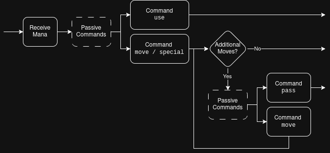

### File Overview
- [Design Document - Description of Approach](Design_Document.md)
- [Milestone 1 - Structure, Config Parsing and Printing](Milestone_1.md)
- Milestone 2 - Commands, Game Logic and Special Powers (this file)
- [Piece Overview (file listing all pieces and their special powers)](Pieces.md)
- [Items Overview (file listing all items, their powers and usage)](Items.md)
- [Error Overview (file listing all errors that must be handled)](Errors.md)

# Milestone 2 - Commands, Game Logic and Special Powers

The **goal** of Milestone 2 (M2) is to implement the **core gameplay mechanics** of the game, including command handling, game logic, and special powers.

This includes parsing and executing player commands, enforcing the rules of the game, handling items and special abilities, and determining how the game progresses and ends.

## Command Handling

This section describes how user commands are parsed, validated, and executed during the game. It defines the expected command structure, valid parameter formats, and how errors should be handled.

<details>
<summary><h3>Command Parameters</h3></summary>

The following table shows the types of parameters a command can have and which input values are valid for the corresponding type.

 
| Variable      | Description                           | Valid Parameter Values          | Example            | Parse Error Message    |
|---------------|---------------------------------------|---------------------------------|--------------------|------------------------|
| `<PLAYER_ID>` | the ID of a player                    | `white` or `black`              | `white`, `BLACK`   | `E_INV_PARAM_PLAYER`   |
| `<SQUARE>`    | the position of a square on the board | regex pattern: `[A-H][1-8]`     | `E5`, `f1`, `g3`   | `E_INV_PARAM_SQUARE`   |
| `<PIECE_ID>`  | the ID of a chess piece               | see [Pieces.md](Pieces.md)      | `K`, `PGLD`        | `E_INV_PARAM_PIECE`    |
 All parameters that include _SQUARE_ in their name count as `<SQUARE>` parameters (e.g. `<TARGET_SQUARE>`).

A `<SQUARE>` parameter describes the position of a square on the board. It must **fully match** (case-insensitively) the regex pattern `[A-H][1-8]`, where `[A-H]` specifies the file and `[1-8]` specifies the rank. The parameter must not contain any additional characters.

All input parameters are case-insensitive and must be normalized (e.g., converted to uppercase) before validation.

If a parameter is invalid, the corresponding error message is printed. Parameters are validated from left to right, and only the first occurring error is reported.

</details>

<details>
<summary><h3>Invalid Commands Handling</h3></summary>

Whenever a command is entered, it must be validated before execution. If an error occurs, the corresponding error message is printed. After that, the command prompt (including a leading newline and the current player) is printed again, allowing the player to enter a new command.

An invalid command must not be executed and must not change the state of the game.

For each invalid command, only one error message is printed. If multiple errors occur, only the one with the highest priority is reported.

**Validation Order and Priority:**

Validation must be performed in the following order:

1. Command name validation
    - If the command is not recognized → `E_UNKNOWN_COMMAND`
2. Parameter count validation
    - If the number of parameters is incorrect → `E_INVALID_PARAM_COUNT`
3. Parameter validation
    - Parameters are validated from left to right
    - The first invalid parameter determines the error message

**General Errors:**

| Rank | Error Description                                                    | Message Key                    |
|------|----------------------------------------------------------------------|--------------------------------|
| 1    | The entered command is not known                                     | `E_UNKNOWN_COMMAND`            |
| 2    | There are more or fewer parameters than expected | `E_INVALID_PARAM_COUNT`        |

</details>

## Commands

This section defines all available commands in the game, including their syntax, behavior, and command-specific error handling.

<details>
<summary><h3>Command: quit</h3></summary>

**Syntax:** `quit`

Terminates the game immediately. No winner is declared.
Quit can be used to terminate the program **any time** the game waits for user input.


</details>

<details>
<summary><h3>Command: board</h3></summary>

**Syntax:** `board`

Toggles automatic board printing.

- Initially, board printing is enabled
- If enabled, executing this command disables it
- If disabled, executing this command enables it and prints the board immediately

When disabled, the board must not be printed in situations where it would normally appear.

</details>

<details>
<summary><h3>Command: help</h3></summary>

 **Syntax:** `help`

 The `help` command prints the following message to the screen.

 ```
 === Commands ============================================================================\n
 - help\n
     Prints this help text.\n
 \n
 - quit\n
     Terminates the game.\n
 \n
 - board\n
     Toggles the board printing.\n
 \n
 - info <PIECE_ID>\n
     Prints piece information.\n
     <PIECE_ID>: The piece ID to be explained.\n
 \n
 - history\n
     Prints the move history in modified chess notation.\n
 \n
 - prison <PLAYER_ID>\n
     Lists pieces captured by the specified player.\n
     <PLAYER_ID>: [White/Black]\n
 \n
 - pass\n
     Ends the current player's turn after a move or special ability.\n
 \n
 - draw\n
     Offers a draw to the opponent.\n
 \n
 - resign\n
     Resigns the game (loss).\n
 \n
 - move <MOVE>\n
     Moves a piece using simplified chess notation.\n
     <MOVE>: a move in the simplified chess notation format.\n
 \n
 - use <SQUARE> [...]\n
     Uses a potion.\n
     <SQUARE>: The location of the piece, whose potion will be used.\n
     [...]: Variable amount of parameters depending on the potion.\n
 \n
 - special <SQUARE> [...]\n
     Activates a piece's special ability.\n
     <SQUARE>: The square where the special piece is located.\n
     [...]: Variable parameters depending on the piece (use info for a piece by piece description).\n
 \n
 =========================================================================================\n
 ```

</details>

<details>
<summary><h3>Command: info</h3></summary>

 **Syntax**: `info <PIECE_ID>`

Prints detailed information about the specified piece. This information can be read  [here](./Pieces.md), or in the message file.

The output format is:
```
<D_BORDER_INFO_B>
[<PIECE_ID> | <PIECE_SHORT_NAME>] <PIECE_NAME>
Mana: <MANA_COST>\n
Description: <PIECE_INFO>
Special: <SPECIAL_SYNTAX>
<D_BORDER_INFO_E>
```

 - `<PIECE_NAME>`       &mdash; The full name of the piece found in the message config with key `D_N_<PIECE_ID>`.
 - `<PIECE_ID>`         &mdash; The ID used to find this piece
 - `<PIECE_SHORT_NAME>` &mdash; The short name displayed on the board, always printed as a black piece.
 - `<MANA_COST>`        &mdash; The mana cost expressed in two digits (e.g `03` instead of `3`).
    - If the mana cost is variable print `XX`.
    - For pieces without an active special ability `Mana: <MANA_COST>\n` is omitted.
 - `<PIECE_INFO>`       &mdash; The info message found in the message config. The key format is `D_I_<PIECE_ID>`.
 - `<SPECIAL_SYNTAX>`   &mdash; Special syntax found in the message config with key `D_S_<PIECE_ID>`.
                                For pieces without an active special ability print `None\n`.

In addition to the error messages described in the beginning of this section, the `info` command must also handle these errors:

| Rank | Error Description                                                    | Message Key                    |
|------|----------------------------------------------------------------------|--------------------------------|
| 6 | `<PIECE_ID>` does not refer to the ID of a chess piece               | `E_INV_PARAM_PIECE`    |
</details>

<details>
<summary><h3>Command: prison</h3></summary>

 **Syntax**: `prison <PLAYER_ID>`

Prints all pieces captured by the specified player. Printing the prison should have the following format:

```
<D_BORDER_PRISON>
<PLAYER_ID>:\n
<LIST_OF_PIECES>\n
<D_BORDER_D>
```

The pieces in `<LIST_OF_PIECES>` should be sorted in descending order according to their value. Pieces of equal value are sorted alphabetically depending on their ID.

Pieces are displayed in the format `[<COUNT>x]<ID>`. where `[]` denotes an **optional** part of the output, which should only be printed if multiple pieces with the same ID have been captured. Pieces with different IDs are separated by a comma and a space `, `.

Example for `<LIST_OF_PIECES>`:
```
Q, 2xB, N, 5xP
```

In addition to the error messages described in the beginning of this section, the `prison` command must also handle these errors:

| Rank | Error Description                                                    | Message Key                    |
|------|----------------------------------------------------------------------|--------------------------------|
| 4    | `<PLAYER_ID>` does not specify a valid player ID (`white` or `black`)| `E_INV_PARAM_PLAYER`   |
</details>

<details>
<summary><h3>Command: special</h3></summary>

**Syntax**: `special <SQUARE> [...]`
 
Activates the special ability of the piece at `<SQUARE>`. Mana is consumed according to the cost of the special power. If the player does not have sufficient mana to use the special power, the error message `E_INSUFFICIENT_MANA` is printed.

`[...]` denotes optional further parameters depending on the special power of the piece. The parameters are described for each special power individually [here](Pieces.md).
For the purposes of `E_INVALID_PARAM_COUNT` this command needs to have at least one parameter.

If not specified otherwise the `special` command ends the player's turn. It is only available as the first move in a player's turn.

In addition to the error messages described in the beginning of this section, the `special` command must also handle these errors:

| Rank | Error Description                                                    | Message Key                    |
|------|----------------------------------------------------------------------|--------------------------------|
| 3    | The special command is currently not available (see [Milestone 1](Milestone_1.md#important-rules) > Important Rules > Moving Multiple Times)                       | `E_SPECIAL_USE_UNAVAILABLE` |
| 5    | The square could not be parsed                                                      | `E_INV_PARAM_SQUARE`           |
| 7    | The square does not contain a piece belonging to the current player  | `E_PLAYER_PIECE_NOT_FOUND`           |
| 8    | The specified piece does not have a special power that can be activated | `E_NO_SPECIAL_POWER` |
| 9    | There are more or fewer parameters than expected for the specified special power | `E_INVALID_PARAM_COUNT_SPECIAL`        |
| 10   | The specified piece is currently frozen (see [Milestone 1](Milestone_1.md#important-rules) > Important Rules > Frozen Pieces)    | `E_PIECE_FROZEN`           |
| 11-18 | Any other errors specific to the piece's special power (see [Pieces.md](Pieces.md)) |  |
| 19   | The player does not have sufficient mana                              | `E_INSUFFICIENT_MANA`               |


</details>

<details>
<summary><h3>Command: move</h3></summary>

**Syntax**: `move <MOVE>`

Executes a move using simplified chess notation.

`<MOVE>` is a chess move usually written as `<PIECE_TYPE><TARGET_SQUARE>`:

- If the move is a capture, i.e. the target square is occupied, the move must instead be written as  `<PIECE_TYPE>x<TARGET_SQUARE>`.
- For pawn moves, the `<PIECE_TYPE>` must be omitted and written as just `<TARGET_SQUARE>`.
- For pawn captures the current file (`a`-`h`) of the pawn must be specified instead of the `<PIECE_TYPE>`: `<FILE>x<TARGET_SQUARE>`.
- For both pawn moves and pawn captures that lead to a pawn promotion, the desired piece ID must be specified with the symbol `=`: `<TARGET_SQUARE>=<PIECE_TYPE>` where `<PIECE_TYPE>` may not be `P` or `K`.

 Examples:
```
move e4
move Bb2
move Nxf5
move hxf6
move d8=Q
move axb8=N
```

 The `move` command locates the piece and the target square, checks if the move is valid depending on the piece, and executes the move and/or capture.
 If a piece is captured it is removed from the board and added to the current player's prison.
 Unless specified otherwise the `move` command ends the current player's turn.

 In addition to the error messages described in the beginning of this section, the `move` command must also handle these errors:

 | Rank | Error Description                                                    | Message Key                    |
 |------|----------------------------------------------------------------------|--------------------------------|
 | 17 | The move could not be parsed, i.e. it does not follow the specified syntax. <br/> **Examples**:<br/>- The target square is not a valid chess square.  <br> - A pawn move specifies the piece type.<br/> - A promotion is specified for a non pawn piece. <br/> - A pawn promotes to a pawn.   | `E_INV_PARAM_MOVE`             |
 | 18 | There is no piece that can perform this move. <br/> **Examples**:<br/>- The path is blocked.<br/>- The piece is frozen.<br/> - The target square contains a friendly piece. <br/> - The move is specified as a capture but the target square is empty. <br/> - A pawn promotion does not end on the opponent's back rank. <br/> - A pawn move to rank 1 or 8 does not specify a promotion. <br/> - A pawn capture specifies a current file that is not adjacent to the target file. <br/> - The player, who issued the move command is in **checkmate**. | `E_INVALID_MOVE`               |

 **Ambiguity:**

 In some cases the `move` command is ambiguous. For example, if there are multiple pieces of the same type that could move to the target square.
 In this case the message `D_AMBIGUOUS_MOVE` is printed and the player prompt is printed.
 The player then enters the starting square of the piece they want to move:

 - If the input is `cancel`, the `move` command is cancelled and the player can enter a new command.
 - If the input is invalid, the corresponding error message is printed, the `move` command is cancelled and the player can enter a new command.
 - If this is not the first move of a turn, the move can never be ambiguous, since only the piece used in the first move can be moved again.
 
 This input must handle the following errors:

 | Rank | Error Description                                                                   | Message Key                    |
 |------|-------------------------------------------------------------------------------------|--------------------------------|
 | 5 | The square could not be parsed                                                      | `E_INV_PARAM_SQUARE`           |
 | 18 | The square does not correspond to any of the ambiguous squares                      | `E_INVALID_MOVE`               |


Ambiguous move handling would look like this.

```
Black mana: 1/10\n
\n
8                                 \n
7                                 \n
6                                 \n
5                                 \n
4                                 \n
3                                 \n
2              ♞N      ♞N         \n
1                                 \n
    A   B   C   D   E   F   G   H\n
\n
White mana: 3/10\n
\n
White > move Ne4\n
The move is ambiguous. Specify the square to be moved or cancel.\n
\n
White > d2\n
```


</details>

<details>
<summary><h3>Command: use</h3></summary>

 **Syntax**: `use <SQUARE> [...]`
 
Uses a potion from the piece at `<SQUARE>`. If the specified piece does not have a potion in its inventory the error message `E_NO_POTION_FOUND` is printed. The `use` command ends the player's turn.

`[...]` denotes optional further parameters depending on the potion.
 The parameters are described for each item individually [here](Items.md).
 For the purposes of `E_INVALID_PARAM_COUNT` this command needs to have at least one parameter.

In addition to the error messages described in the beginning of this section, the `use` command must also handle these errors:

 | Rank | Error Description                                                    | Message Key                    |
 |------|----------------------------------------------------------------------|--------------------------------|
 | 3 | The `use` command is currently not available (see [Milestone 1](Milestone_1.md#important-rules) > Important Rules > Moving Multiple Times)                       | `E_SPECIAL_USE_UNAVAILABLE` |
 | 5 | The square could not be parsed                                       | `E_INV_PARAM_SQUARE`           |
 | 7 | The square does not contain a piece belonging to the current player  | `E_PLAYER_PIECE_NOT_FOUND`    |
 | 20 | The specified piece does not have a potion in its inventory          | `E_NO_POTION_FOUND`            |
 | 21 | There are more or fewer parameters than expected for the specified potion                     | `E_INVALID_PARAM_COUNT_USE`        |
 | 22 | Any additional parameters specific to the potion are invalid (see [Items.md](Items.md))  | `E_INV_PARAM_USE`        |

</details>

<details>
<summary><h3>Command: pass</h3></summary>

**Syntax**: `pass`

This command is only available if the player has already made at least one normal move or has used at least one special power in the current turn. Otherwise the error message `E_INVALID_PASS` is printed.

</details>

<details>
<summary><h3>Command: resign</h3></summary>

**Syntax**: `resign`

When a player uses the `resign` command the game immediately ends.

- If the player resigns while currently being in a **stalemate** the game is considered a draw.
- If the player resigns while currently being in a **checkmate** the game is considered a normal win for the opponent instead of a resignation win.
- In all other cases the opponent wins via resignation.

After execution, proceed with [game end logic](Milestone_2.md#game-end).

</details>

<details>
<summary><h3>Command: draw</h3></summary>

**Syntax**: `draw`

Offers a draw to the opponent.
- If the opponent accepts the draw, the game ends immediately and the program proceeds with [game end logic](Milestone_2.md#game-end).
- If the opponent rejects the offer, the game continues as normal.

Issuing the `draw` command prints following prompt:

```
Player <PLAYER_ID> has offered a draw. Would you like to accept? (yes/no)\n
<OPPONENT_ID> > 
```

Where `<OPPONENT_ID>` is the color of the opponent (`White` or `Black`)

If the input is `yes` the draw is accepted and the game ends (normal game end logic). If the input is `no` the draw is rejected and the game continues as normal.

This input must handle the following errors:

 | Rank | Error Description                                                    | Message Key                    |
 |------|----------------------------------------------------------------------|--------------------------------|
 | 24   | The answer to the prompt was neither `yes` nor `no`                  | `E_INV_PARAM_YES_NO`           |

</details>

<details>
<summary><h3>Command: history</h3></summary>

 **Syntax**: `history`

 The `history` command prints all rounds of the game in a modified version of chess notation.

 The output of the history command looks like this:

```
<D_BORDER_HISTORY>
\n
<D_HISTORY_HEADER>
<ROUNDS>
\n
<D_BORDER_D>
```

 Where `<ROUNDS>` consists of every individual round of the game printed in the following format:

```
<ROUND_NUMBER>| <WHITE_MOVE> | <BLACK_MOVE> |\n
```

 `<ROUND_NUMBER>` is the number of the round, starting at `1`. The number is printed left-aligned and padded with spaces to a width of 3.

 `<WHITE_MOVE>` and `<BLACK_MOVE>` are the moves made by white and black in the corresponding turn.
 They are printed left-aligned and padded with spaces to a width of 8.
 Special powers are denoted as `S<SQUARE>` where `<SQUARE>` is the lowercase square of the piece that used the special power.
 The use of potions is denoted as `<SHORT_NAME><SQUARE>` where `<SHORT_NAME>` refers to the potion that was used and `<SQUARE>` is the lowercase square of the piece that used the potion.
 Normal moves are generally printed in the same way in which they were entered for the move command, with the following changes:
 - Any letter referring to a piece type (the piece being moved or the promoted piece) is printed as uppercase
 - All other letters are printed as lowercase
 - If a move was ambiguous when it was entered, the starting square is added to the move in the format `<START_SQUARE>:<MOVE>`

 If a turn consists of multiple moves or special powers, each move is printed in a separate line. For example the first round consisted of 2 white moves followed by 3 black moves, the output would look like this:
```
1  | e4       | d6       |\n
   | e5       | dxe5     |\n
   |          | e4       |\n
```
</details>

## Items

This section describes how items are generated, collected, stored, and used during the game.

For a complete list of all available items and their effects, see [Items.md](Items.md).

Items are generated on spawn squares (see [Game Board](Milestone_2.md#game-board) > Spawn Square). A piece collects an item (i.e. it is moved to the piece's inventory)
- by moving onto a square that contains an item,
- by already standing on a square when a new item spawns there, or
- by capturing a piece that has an item in its inventory.

In all cases, the item is transferred to the piece.

Each piece can hold at most one item. If a piece collects a new item while already holding one, the existing item is discarded and replaced by the new item.

There are two types of items:

- **Tools** have passive effects that are automatically active while the tool is in the piece’s inventory.
- **Potions** have active effects and must be explicitly used via the `use` command (see [Commands](Milestone_2.md#commands) > Command: use). Potions are consumed upon use. Using an item does not consume mana.

## Player Turn

 A player's turn follows the following structure:

 

 First the player receives mana. Passive commands (`board`, `help`, `info`, `prison`, `draw`, `history`) can be used at any time.
 The commands `move`, `special` or `use` end the player's turn, unless they result in an additional move for the player (See [Milestone 1](Milestone_1.md#important-rules) > Important Rules > Moving Multiple Times).
 For additional moves, `special` and `use` are unavailable but `pass` can be used to end the turn.

<details>
<summary><h3>Mana</h3></summary>

Players receive mana at the beginning of their turn. The total amount of mana a player can hold is limited by the size of their mana pool. If a player would gain more mana than their pool allows, any excess mana is lost. A player’s mana can never become negative.

If a special power requires more mana than the player currently has available, the error message `E_INSUFFICIENT_MANA` is printed and the action is not executed.

The mana gained per turn is determined in the following way:
- Each player always receives `1` mana at the beginning of their turn.
- Each player gains `1` extra mana for each of their pieces currently standing on a mana square.

</details>

## Game Board

The game board printing is described in [Milestone 1](Milestone_1.md#playing-the-game) > Playing the Game > Game Board Printing. In addition to regular black and white squares, the board contains _special squares_ with unique effects.

<details>
<summary><h3>Black Square</h3></summary>

**ANSI escape code:** `\033[48;5;94m` (brown)

This square affects bishop movement. Only bishops with the inherent color _black_ may move onto or over this square.

</details>

<details>
<summary><h3>White Square</h3></summary>

**ANSI escape code:** `\033[48;5;223m` (beige)

This square affects bishop movement. Only bishops with the inherent color _white_ may move onto or over this square.

</details>

<details>
<summary><h3>Mana Squares</h3></summary>

**ANSI escape code:** `\033[48;5;32m` (blue)
**Config ID:** `MANA`

When a piece moves onto this square, the owning player immediately gains `1` mana. If the piece remains on the square, the player gains an additional `1` mana at the beginning of each of their turns.

</details>

<details>
<summary><h3>Boost Squares</h3></summary>

**ANSI escape code:** `\033[48;5;226m` (yellow)
**Config ID:** `BOOST`

When a piece moves onto this square, the player may immediately perform an additional move with the same piece (see [Milestone 1](Milestone_1.md#important-rules) > Important Rules > Moving Multiple Times).

This effect can occur multiple times within a single turn, allowing a sequence of additional moves if multiple boost squares are reached consecutively.

</details>

<details>
<summary><h3>Spawn Squares</h3></summary>

**ANSI escape code:** `\033[48;5;28m` (green)
**Config ID:** `SPAWN`

At the beginning of every round whose number is divisible by 3 (e.g. 3, 6, 9, ...), the square attempts to spawn an item.

A new item is spawned only if there is currently no item on the square **and** no piece standing on the square that already holds an item.

Items are generated in the order defined by the spawner’s list from the configuration file. The next item in the list is only considered once the previous one has been successfully spawned. After reaching the end of the list, the process restarts from the beginning.

If a piece with an empty inventory is standing on the square when an item spawns, the item is immediately transferred to that piece.

</details>

## Game End

Once a game-ending condition is reached, the program enters the ending sequence. During this sequence,
1. the winner is determined and announced,
2. the new Elo scores are calculated and printed,
3. and the results are written to an output file.

### Winner proclamation

Depending on how the game ends, a different message is printed.

**Normal Win / Loss**

This message is printed if
- a king is captured,
- a player resigns while in checkmate, or
- a golden pawn reaches the opponent's back rank.

```
This was a great match! Well done to you both!\n
Good job to <WINNER_COLOR> for winning in <TURN_COUNT> turns.\n
```

- `<WINNER_COLOR>` &mdash; the color of the player who won the game
- `<TURN_COUNT>` &mdash; the total number of turns played in the game


**Resignation**

This message is printed if a player resigns and no special condition applies.

```
Oh I see one of you couldn't take the pressure...\n
Well done to <WINNER_COLOR> for making <RESIGNER_COLOR> resign in <TURN_COUNT> turns.\n
```

- `<WINNER_COLOR>` &mdash; the color of the player who won the game
- `<RESIGNER_COLOR>` &mdash; the color of the player who resigned, if applicable
- `<TURN_COUNT>` &mdash; the total number of turns played in the game

**Draw**

This message is printed if
- both players agree to a draw,
- the maximum turn count is exceeded,
- a player resigns while in a stalemate, or
- both kings were captured in the same turn (see [Pieces.md](Pieces.md#pawn) > Explosive Pawn)

```
This game ended in a draw because <CAUSE_STRING>.\n
Thank you for playing <TURN_COUNT> turns.\n
```

- `<CAUSE_STRING>` &mdash; is either:
    - `you both agreed to a draw` if the `draw` command was successfully executed.
    - `too many turns were played` if the maximum turn count is exceeded.
    - `of stalemate` if a player resigns while in a stalemate.
    - `you both lost your king` if both kings were captured in the same turn.
- `<TURN_COUNT>` &mdash; the total number of turns played in the game

### New Elo Scores

After the winner is determined, the new Elo ratings are calculated. The expected score of each player is computed first, followed by the updated ratings based on the match outcome.

You do not need to know how it mathematically works, but if you are interested read the Theory section of [this](https://en.wikipedia.org/wiki/Elo_rating_system) wikipedia article.

Let:
- $`R_W`$ be the White player's current rating (read in from config)
- $`R_B`$ be the Black player's current rating (read in from config)
- $`E_W`$ be the White player's expected score
- $`E_B`$ be the Black player's expected score
- $`S_W`$ be the White player's actual score (`1` for win, `0.5` for draw and `0` for loss)
- $`S_B`$ be the Black player's actual score (`1` for win, `0.5` for draw and `0` for loss)
- $`K`$ be the K-factor, a constant of `32` in our case

To compute the expected scores use these formulas:

```math
  E_W = \frac{Q_W}{Q_W + Q_B}
```

where

```math
  Q_x = 10^{R_x / 400}
```

and
```math
  E_B = 1 - E_W
```
.

Now the new scores must be calculated using:

```math
\begin{align*}
 R'_W &= R_W + K \cdot (S_W - E_W)\\
 R'_B &= R_B + K \cdot (S_B - E_B)
\end{align*}
```

These new scores $R'_W$ and $R'_B$ are **rounded down** to the nearest integer and are printed in the following manner:

```
\n
The new Elo scores are:\n
 - White: <NEW_WHITE_SCORE>\n
 - Black: <NEW_BLACK_SCORE>\n
\n
```

### Saving to the output file

After printing the Elo scores, the user is prompted to enter an output file path:

```
Enter the output file name\n
 > 
```

If the input is empty, no file is created and the program terminates normally. Otherwise, the specified file is created or overwritten if it already exists.

If the file cannot be opened for writing, the error `E_INVALID_PATH` is printed and the prompt is shown again.

The resulting output file contains
- the winner proclamation message and
- the Elo score sections
- the output of the `history` command

<details>
<summary><h4>Example</h4></summary>

The full output file could look like this:

```
Oh I see one of you couldn't take the pressure...\n
Well done to Black for making White resign in 3 turns.\n
\n
The new Elo scores are:\n
 - White: 992\n
 - Black: 1000\n
\n
1  | e4       | d6       |\n
2  | e5       | dxe5     |\n
3  |          | e4       |\n
```

</details>

## Example of Milestone 2 Output

<details>
<summary>Example</summary>

```
~*~*~*~*~*~*~*~*~*~*~*~*~*~*~*~*~*~*~*~*~*~*~*~*~
                Welcome To Chess++
~*~*~*~*~*~*~*~*~*~*~*~*~*~*~*~*~*~*~*~*~*~*~*~*~
Where do you want to place R (2 remaining)?
White > auto
Where do you want to place R (2 remaining)?
Black > auto
                    Chessboard
~*~*~*~*~*~*~*~*~*~*~*~*~*~*~*~*~*~*~*~*~*~*~*~*~
Turn 1 / 10000

Black mana: 0/10000

8  ♜r  ♞n  ♝b  ♛q  ♚k  ♝b  ♞n  ♜r 
7  ♟p  ♟p  ♟p  ♟p  ♟p  ♟p  ♟p  ♟p 
6                                 
5                                 
4                                 
3                                 
2  ♟P  ♟P  ♟P  ♟P  ♟P  ♟P+ ♟P- ♟P 
1  ♜R  ♞N  ♝B  ♛Q  ♚K  ♝Bp ♞N  ♜R 
    A   B   C   D   E   F   G   H

White mana: 1/10000
~*~*~*~*~*~*~*~*~*~*~*~*~*~*~*~*~*~*~*~*~*~*~*~*~

White > move g4
                    Chessboard
~*~*~*~*~*~*~*~*~*~*~*~*~*~*~*~*~*~*~*~*~*~*~*~*~
Turn 1 / 10000

White mana: 1/10000

1  ♜R  ♞N  ♝Bp ♚K  ♛Q  ♝B  ♞N  ♜R 
2  ♟P      ♟P+ ♟P  ♟P  ♟P  ♟P  ♟P 
3                                 
4      ♟P-                        
5                                 
6                                 
7  ♟p  ♟p  ♟p  ♟p  ♟p  ♟p  ♟p  ♟p 
8  ♜r  ♞n  ♝b  ♚k  ♛q  ♝b  ♞n  ♜r 
    H   G   F   E   D   C   B   A

Black mana: 1/10000
~*~*~*~*~*~*~*~*~*~*~*~*~*~*~*~*~*~*~*~*~*~*~*~*~

Black > move e4
[ERROR] This move is currently not possible.

Black > move e5
                    Chessboard
~*~*~*~*~*~*~*~*~*~*~*~*~*~*~*~*~*~*~*~*~*~*~*~*~
Turn 2 / 10000

Black mana: 1/10000

8  ♜r  ♞n  ♝b  ♛q  ♚k  ♝b  ♞n  ♜r 
7  ♟p  ♟p  ♟p  ♟p      ♟p  ♟p  ♟p 
6                                 
5                  ♟p             
4                          ♟P-    
3                                 
2  ♟P  ♟P  ♟P  ♟P  ♟P  ♟P+     ♟P 
1  ♜R  ♞N  ♝B  ♛Q  ♚K  ♝Bp ♞N  ♜R 
    A   B   C   D   E   F   G   H

White mana: 3/10000
~*~*~*~*~*~*~*~*~*~*~*~*~*~*~*~*~*~*~*~*~*~*~*~*~

White > move bg2
                    Chessboard
~*~*~*~*~*~*~*~*~*~*~*~*~*~*~*~*~*~*~*~*~*~*~*~*~
Turn 2 / 10000

White mana: 3/10000

1  ♜R  ♞N      ♚K  ♛Q  ♝B  ♞N  ♜R 
2  ♟P  ♝Bp ♟P+ ♟P  ♟P  ♟P  ♟P  ♟P 
3                                 
4      ♟P-                        
5              ♟p                 
6                                 
7  ♟p  ♟p  ♟p      ♟p  ♟p  ♟p  ♟p 
8  ♜r  ♞n  ♝b  ♚k  ♛q  ♝b  ♞n  ♜r 
    H   G   F   E   D   C   B   A

Black mana: 2/10000
~*~*~*~*~*~*~*~*~*~*~*~*~*~*~*~*~*~*~*~*~*~*~*~*~

Black > move qh4
                    Chessboard
~*~*~*~*~*~*~*~*~*~*~*~*~*~*~*~*~*~*~*~*~*~*~*~*~
Turn 3 / 10000

Black mana: 2/10000

8  ♜r  ♞n  ♝b      ♚k  ♝b  ♞n  ♜r 
7  ♟p  ♟p  ♟p  ♟p      ♟p  ♟p  ♟p 
6                                 
5                  ♟p             
4                          ♟P- ♛q 
3                                 
2  ♟P  ♟P  ♟P  ♟P  ♟P  ♟P+ ♝Bp ♟P 
1  ♜R  ♞N  ♝B  ♛Q  ♚K      ♞N  ♜R 
    A   B   C   D   E   F   G   H

White mana: 5/10000
~*~*~*~*~*~*~*~*~*~*~*~*~*~*~*~*~*~*~*~*~*~*~*~*~

White > special g2 b7
                    Chessboard
~*~*~*~*~*~*~*~*~*~*~*~*~*~*~*~*~*~*~*~*~*~*~*~*~
Turn 3 / 10000

White mana: 2/10000

1  ♜R  ♞N      ♚K  ♛Q  ♝B  ♞N  ♜R 
2  ♟P  ♝Bp ♟P+ ♟P  ♟P  ♟P  ♟P  ♟P 
3                                 
4  ♛q  ♟P-                        
5              ♟p                 
6                                 
7  ♟p  ♟p  ♟p      ♟p  ♟p  ♟P  ♟p 
8  ♜r  ♞n  ♝b  ♚k      ♝b  ♞n  ♜r 
    H   G   F   E   D   C   B   A

Black mana: 3/10000
~*~*~*~*~*~*~*~*~*~*~*~*~*~*~*~*~*~*~*~*~*~*~*~*~

Black > move bxb7
                    Chessboard
~*~*~*~*~*~*~*~*~*~*~*~*~*~*~*~*~*~*~*~*~*~*~*~*~
Turn 4 / 10000

Black mana: 3/10000

8  ♜r  ♞n          ♚k  ♝b  ♞n  ♜r 
7  ♟p  ♝b  ♟p  ♟p      ♟p  ♟p  ♟p 
6                                 
5                  ♟p             
4                          ♟P- ♛q 
3                                 
2  ♟P  ♟P  ♟P  ♟P  ♟P  ♟P+ ♝Bp ♟P 
1  ♜R  ♞N  ♝B  ♛Q  ♚K      ♞N  ♜R 
    A   B   C   D   E   F   G   H

White mana: 4/10000
~*~*~*~*~*~*~*~*~*~*~*~*~*~*~*~*~*~*~*~*~*~*~*~*~

White > move nc3
                    Chessboard
~*~*~*~*~*~*~*~*~*~*~*~*~*~*~*~*~*~*~*~*~*~*~*~*~
Turn 4 / 10000

White mana: 4/10000

1  ♜R  ♞N      ♚K  ♛Q  ♝B      ♜R 
2  ♟P  ♝Bp ♟P+ ♟P  ♟P  ♟P  ♟P  ♟P 
3                      ♞N         
4  ♛q  ♟P-                        
5              ♟p                 
6                                 
7  ♟p  ♟p  ♟p      ♟p  ♟p  ♝b  ♟p 
8  ♜r  ♞n  ♝b  ♚k          ♞n  ♜r 
    H   G   F   E   D   C   B   A

Black mana: 4/10000
~*~*~*~*~*~*~*~*~*~*~*~*~*~*~*~*~*~*~*~*~*~*~*~*~

Black > move bf3
                    Chessboard
~*~*~*~*~*~*~*~*~*~*~*~*~*~*~*~*~*~*~*~*~*~*~*~*~
Turn 5 / 10000

Black mana: 4/10000

8  ♜r  ♞n          ♚k  ♝b  ♞n  ♜r 
7  ♟p      ♟p  ♟p      ♟p  ♟p  ♟p 
6                                 
5                  ♟p             
4                          ♟P- ♛q 
3          ♞N          ♝b         
2  ♟P  ♟P  ♟P  ♟P  ♟P  ♟P+ ♝Bp ♟P 
1  ♜R      ♝B  ♛Q  ♚K      ♞N  ♜R 
    A   B   C   D   E   F   G   H

White mana: 6/10000
~*~*~*~*~*~*~*~*~*~*~*~*~*~*~*~*~*~*~*~*~*~*~*~*~

White > special f2
                    Chessboard
~*~*~*~*~*~*~*~*~*~*~*~*~*~*~*~*~*~*~*~*~*~*~*~*~
Turn 5 / 10000

White mana: 1/10000

1  ♜R  ♞N     !♚K  ♛Q  ♝B      ♜R 
2  ♟P  ♝Bp     ♟P  ♟P  ♟P  ♟P  ♟P 
3          ♟P+         ♞N         
4  ♛q  ♟P-                        
5              ♟p                 
6                                 
7  ♟p  ♟p  ♟p      ♟p  ♟p      ♟p 
8  ♜r  ♞n  ♝b  ♚k          ♞n  ♜r 
    H   G   F   E   D   C   B   A

Black mana: 5/10000
~*~*~*~*~*~*~*~*~*~*~*~*~*~*~*~*~*~*~*~*~*~*~*~*~

Black > move qxe1
This was a great match! Well done to you both!
Good job to Black for winning in 5 turns.

The new Elo scores are:
 - White: 984
 - Black: 1016

Enter the output file name
 > GameResult

```


### Output File:


```
This was a great match! Well done to you both!
Good job to Black for winning in 5 turns.

The new Elo scores are:
 - White: 984
 - Black: 1016

~*~*~*~*~*~*~*~*~*~*~*~*~*~*~*~*~*~*~*~*~*~*~*~*~

                   Move History
1  | g4       | e5       |
2  | bg2      | qh4      |
3  | Sg2      | bxb7     |
4  | nc3      | bf3      |
5  | Sf2      | qxe1     |
```

</details>
